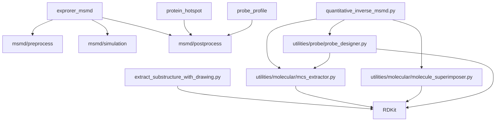
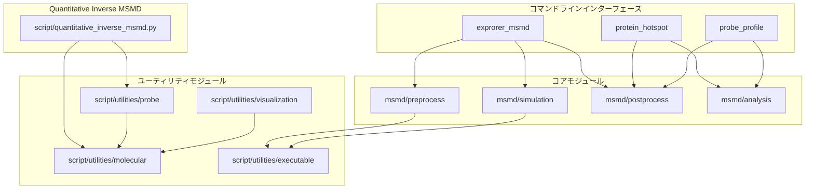
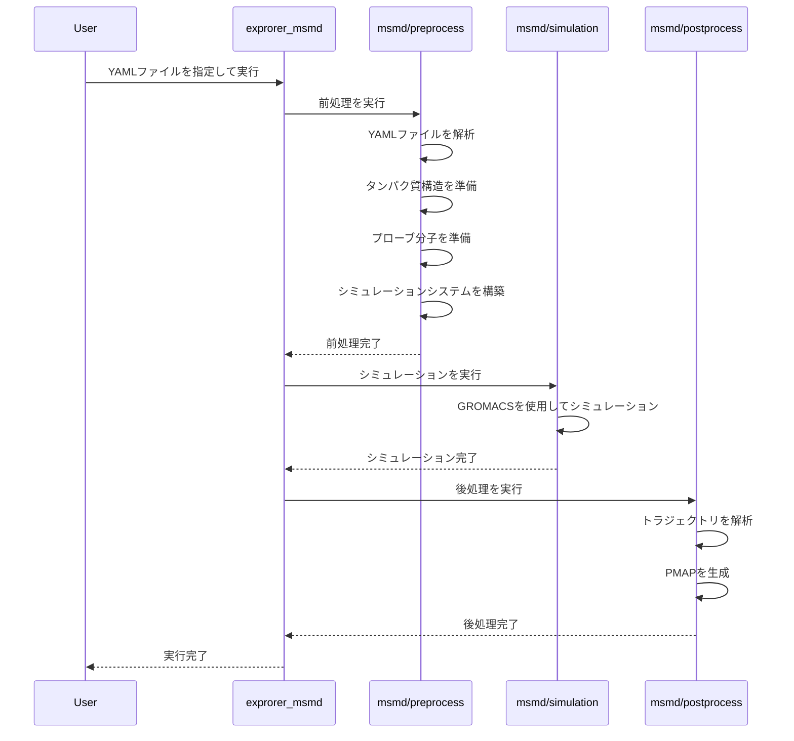
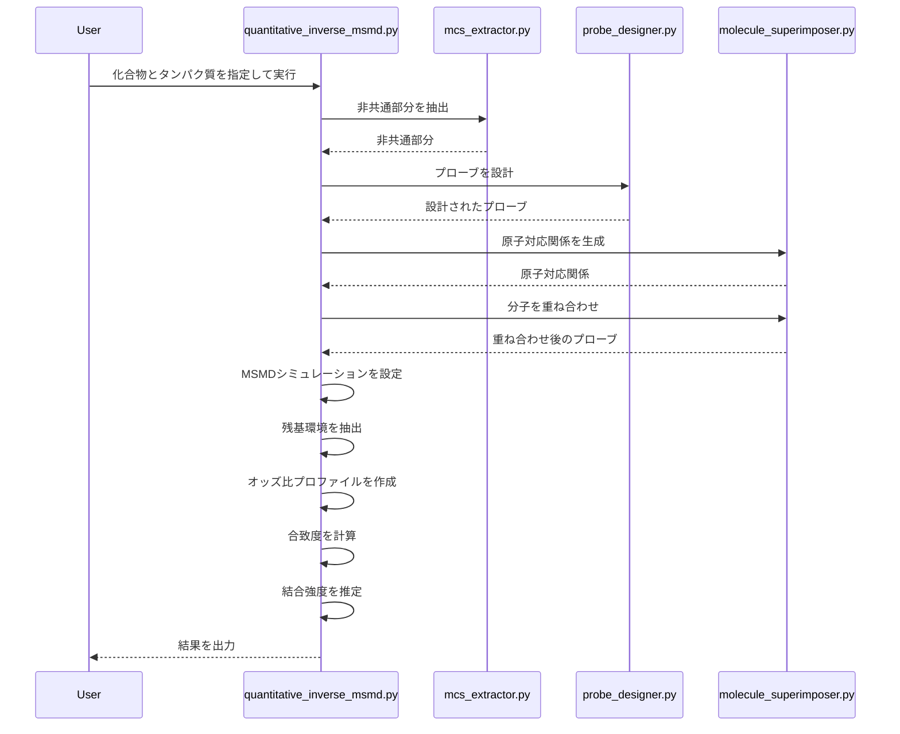

# 概要とアーキテクチャ

## プロジェクト概要

### プロジェクトの目的と背景

EXPRORER_MSMDは、共溶媒分子動力学（Mixed-Solvent Molecular Dynamics; MSMD）シミュレーションエンジンと解析ツールをまとめたリポジトリです。このプロジェクトの主な目的は以下の通りです：

- GROMACSを用いたMSMDを自動的に行うためのシステムを提供する
- タンパク質表面のホットスポットを探索する機能を提供する
- プローブ分子周辺の残基環境を可視化する機能を提供する
- 分子の特定の原子を置換した場合の結合親和性の変化を見積もる機能を提供する

このプロジェクトは、以下の論文に基づいています：

1. **Keisuke Yanagisawa**, et al. "EXPRORER: Rational Cosolvent Set Construction Method for Cosolvent Molecular Dynamics Using Large-Scale Computation", *Journal of Chemical Information and Modeling*, **61**: 2744-2753, 2021/06.
2. **Keisuke Yanagisawa**, et al. "Inverse Mixed-Solvent Molecular Dynamics for Visualization of the Residue Interaction Profile of Molecular Probes", *International Journal of Molecular Sciences*, **23**: 4749, 2022/04.

### アーキテクチャの概要

EXPRORER_MSMDは、以下の主要なコンポーネントから構成されています：

1. **MSMDシミュレーションエンジン**：GROMACSを使用してMSMDシミュレーションを実行するコンポーネント
2. **タンパク質ホットスポット探索**：シミュレーション結果からタンパク質表面のホットスポットを特定するコンポーネント
3. **プローブ分子周辺残基環境取得**：プローブ分子の周囲の残基環境を解析するコンポーネント
4. **Quantitative Inverse MSMD**：分子の特定の原子を置換した場合の結合親和性の変化を見積もるコンポーネント

これらのコンポーネントは、以下のような階層構造になっています：

```
EXPRORER_MSMD
├── コマンドラインインターフェース（CLI）
│   ├── exprorer_msmd
│   ├── protein_hotspot
│   └── probe_profile
├── コアモジュール
│   ├── MSMDシミュレーションエンジン
│   ├── タンパク質ホットスポット探索
│   └── プローブ分子周辺残基環境取得
└── ユーティリティモジュール
    ├── 分子操作関連
    ├── プローブ設計関連
    └── 可視化関連
```

### 主要なモジュールと依存関係

EXPRORER_MSMDの主要なモジュールとその依存関係は以下の通りです：

#### 主要なモジュール

1. **msmd/**：MSMDシミュレーションエンジンのコアモジュール
   - **preprocess/**：シミュレーション前の準備を行うモジュール
   - **simulation/**：GROMACSを使用したシミュレーションを実行するモジュール
   - **postprocess/**：シミュレーション結果の解析を行うモジュール

2. **script/**：各種スクリプトを含むディレクトリ
   - **quantitative_inverse_msmd.py**：Quantitative Inverse MSMDを実行するスクリプト
   - **utilities/**：ユーティリティモジュール
     - **molecular/**：分子操作関連のモジュール
       - **mcs_extractor.py**：MCS計算と非共通部分抽出モジュール
       - **molecule_superimposer.py**：分子の重ね合わせ自動化モジュール
       - **smiles_to_sdf.py**：SMILES表記からSDFファイルを生成するモジュール
     - **probe/**：プローブ分子関連のモジュール
       - **probe_designer.py**：プローブ設計モジュール

#### 依存関係

主要なモジュール間の依存関係は以下の通りです：



外部依存関係：

- **Python 3**：プロジェクト全体で使用
- **RDKit**：分子操作関連のモジュールで使用
- **NumPy**：数値計算に使用
- **Matplotlib**：可視化に使用
- **AmberTools 20**：分子構造の前処理に使用
- **Gromacs 2021.5**：シミュレーションに使用
- **Packmol 18.169**：系の構築に使用

## 開発環境の構築方法

### Dockerを使用した開発環境の構築

1. Dockerをインストールします（[Docker公式サイト](https://www.docker.com/get-started)からダウンロード）

2. リポジトリをクローンします：
   ```bash
   git clone https://github.com/your-username/exprorer_msmd.git
   cd exprorer_msmd
   ```

3. Dockerイメージをビルドします：
   ```bash
   docker build -t exprorer_msmd-dev -f .devcontainer/Dockerfile .
   ```

4. 開発用のDockerコンテナを実行します：
   ```bash
   docker run -it --rm -v $(pwd):/workdir -p 8888:8888 exprorer_msmd-dev
   ```

   これにより、ホストマシンのカレントディレクトリがコンテナ内の`/workdir`にマウントされ、Jupyter Notebookのポート（8888）が公開されます。

5. （オプション）Jupyter Notebookを起動します：
   ```bash
   jupyter notebook --ip=0.0.0.0 --port=8888 --no-browser --allow-root
   ```

### 手動での開発環境の構築

1. Python 3.8以上をインストールします

2. 必要なPythonライブラリをインストールします：
   ```bash
   pip install numpy rdkit-pypi matplotlib pillow pyyaml jupyter
   ```

3. AmberTools 20をインストールします（[AmberMD公式サイト](https://ambermd.org/GetAmber.php)を参照）

4. Gromacs 2021.5をインストールします（[Gromacs公式サイト](https://www.gromacs.org/Downloads)を参照）

5. Packmolをインストールします（[Packmol公式サイト](https://m3g.github.io/packmol/)を参照）

6. 環境変数を設定します：
   ```bash
   export TLEAP=/path/to/tleap
   export CPPTRAJ=/path/to/cpptraj
   export GMX=/path/to/gmx
   export PACKMOL=/path/to/packmol
   ```

7. リポジトリをクローンします：
   ```bash
   git clone https://github.com/your-username/exprorer_msmd.git
   cd exprorer_msmd
   ```

8. 動作確認を行います：
   ```bash
   ./exprorer_msmd --help
   ```

## コードアーキテクチャと依存関係

### 全体的なコード構造

#### ディレクトリ構造の詳細説明

```
exprorer_msmd/
├── bin/                      # 実行可能ファイル
├── debug/                    # デバッグ用ファイル
├── docs/                     # ドキュメント
│   ├── en/                   # 英語ドキュメント
│   │   ├── impl/            # 実装の詳細
│   │   └── user_guide/      # ユーザーガイド
│   └── ja/                   # 日本語ドキュメント
│       ├── impl/            # 実装の詳細
│       └── user_guide/      # ユーザーガイド
├── example/                  # サンプルファイル
├── msmd/                     # MSMDシミュレーションエンジンのコアモジュール
│   ├── analysis/            # 解析モジュール
│   ├── biopython/           # BioPythonの拡張
│   ├── executable/          # 実行可能ファイル関連
│   ├── preprocess/          # 前処理モジュール
│   ├── probe/               # プローブ関連モジュール
│   ├── protein/             # タンパク質関連モジュール
│   ├── simulation/          # シミュレーションモジュール
│   │   └── gromacs/        # GROMACS関連
│   └── standard_library/    # 標準ライブラリの拡張
├── probe_library/           # プローブライブラリ
├── script/                   # スクリプト
│   ├── rdkit_stubs/         # RDKitのスタブ
│   ├── template/            # テンプレートファイル
│   └── utilities/           # ユーティリティモジュール
│       ├── Bio/             # BioPython関連
│       ├── executable/      # 実行可能ファイル関連
│       │   └── template/   # テンプレートファイル
│       ├── molecular/       # 分子操作関連
│       ├── parmed/          # ParmEd関連
│       ├── probe/           # プローブ関連
│       ├── pytraj/          # PyTraj関連
│       ├── scipy/           # SciPy関連
│       └── visualization/   # 可視化関連
└── template/                 # テンプレートファイル
```

#### 各ディレクトリの役割と責任

- **bin/**：実行可能ファイルを格納するディレクトリ。主にシェルスクリプトやバイナリファイルが含まれる。
- **debug/**：デバッグ用のファイルを格納するディレクトリ。開発中のデバッグ情報やログが含まれる。
- **docs/**：ドキュメントを格納するディレクトリ。英語と日本語の両方のドキュメントが含まれる。
- **example/**：サンプルファイルを格納するディレクトリ。ユーザーが参照できるサンプルデータやプロトコルが含まれる。
- **msmd/**：MSMDシミュレーションエンジンのコアモジュールを格納するディレクトリ。シミュレーションの前処理、実行、後処理に関するコードが含まれる。
- **probe_library/**：プローブライブラリを格納するディレクトリ。様々なプローブ分子のSDFファイルが含まれる。
- **script/**：各種スクリプトを格納するディレクトリ。Quantitative Inverse MSMDや各種ユーティリティスクリプトが含まれる。
- **template/**：テンプレートファイルを格納するディレクトリ。シミュレーションや解析に使用するテンプレートファイルが含まれる。

### モジュール間の依存関係

#### 依存関係図（クラス図、パッケージ図）

以下は、主要なモジュール間の依存関係を示すパッケージ図です：



#### 循環依存の回避方法

EXPRORER_MSMDでは、以下の方法で循環依存を回避しています：

1. **階層的な設計**：モジュールを階層的に設計し、上位モジュールが下位モジュールに依存するようにしています。例えば、`quantitative_inverse_msmd.py`は`utilities/molecular`に依存しますが、その逆はありません。

2. **インターフェースの分離**：モジュール間のインターフェースを明確に分離し、必要最小限の依存関係のみを持つようにしています。

3. **依存性の注入**：直接的な依存関係を避けるために、依存性の注入パターンを使用しています。例えば、`molecule_superimposer.py`は直接`mcs_extractor.py`に依存せず、必要な機能を引数として受け取ります。

4. **ファクトリーパターン**：複雑なオブジェクトの生成を専用のファクトリークラスに委譲することで、依存関係を局所化しています。

#### インポート構造の説明

EXPRORER_MSMDでは、以下のようなインポート構造を採用しています：

1. **絶対インポート**：パッケージ外部からのインポートには絶対インポートを使用しています。
   ```python
   import numpy as np
   from rdkit import Chem
   ```

2. **相対インポート**：パッケージ内部のモジュールからのインポートには相対インポートを使用しています。
   ```python
   from ..utilities.molecular.mcs_extractor import extract_non_common_parts
   ```

3. **遅延インポート**：大きなモジュールや使用頻度の低いモジュールは、必要になった時点でインポートする遅延インポートを使用しています。
   ```python
   def function_that_needs_matplotlib():
       import matplotlib.pyplot as plt
       # ...
   ```

4. **条件付きインポート**：環境によって利用可能なモジュールが異なる場合は、条件付きインポートを使用しています。
   ```python
   try:
       from rdkit.Chem.rdmolops import GetSymmSSSR
   except:
       # 代替手段を使用
   ```

### モジュール間の相互作用

#### シーケンス図による主要な処理フローの説明

以下は、MSMDシミュレーションの主要な処理フローを示すシーケンス図です：



以下は、Quantitative Inverse MSMDの主要な処理フローを示すシーケンス図です：



#### モジュール間の通信方法

EXPRORER_MSMDでは、以下の方法でモジュール間の通信を行っています：

1. **関数呼び出し**：最も基本的な通信方法として、関数呼び出しを使用しています。例えば、`quantitative_inverse_msmd.py`は`extract_non_common_parts`関数を呼び出して非共通部分を抽出します。

2. **ファイルベースの通信**：中間結果をファイルに保存し、他のモジュールがそれを読み込むことで通信を行います。例えば、シミュレーション結果はファイルに保存され、後処理モジュールがそれを読み込みます。

3. **設定ファイルを介した通信**：YAMLファイルなどの設定ファイルを介して、モジュール間で設定情報を共有します。

4. **オブジェクトの受け渡し**：Pythonオブジェクトを直接受け渡すことで、モジュール間でデータを共有します。例えば、RDKitの分子オブジェクトを各モジュール間で受け渡します。

### データフローの説明

#### 入力から出力までのデータ変換プロセス

MSMDシミュレーションにおけるデータ変換プロセスは以下の通りです：

1. **入力**：YAMLファイル、タンパク質のPDBファイル、プローブのSDFファイル
2. **前処理**：
   - YAMLファイルの解析
   - タンパク質構造の準備（水素原子の追加、プロトン化状態の最適化など）
   - プローブ分子の準備
   - シミュレーションシステムの構築（溶媒の追加、イオンの追加など）
3. **シミュレーション**：
   - エネルギー最小化
   - 平衡化
   - 本番シミュレーション
4. **後処理**：
   - トラジェクトリの解析
   - PMAPの生成
5. **出力**：PMAPファイル（OpenDXフォーマット）、解析結果

Quantitative Inverse MSMDにおけるデータ変換プロセスは以下の通りです：

1. **入力**：2つの化合物のSDFファイル、タンパク質のPDBファイル
2. **非共通部分の抽出**：
   - MCSの計算
   - 非共通部分の抽出
3. **プローブの設計**：
   - 非共通部分に合うプローブの設計
4. **分子の重ね合わせ**：
   - 原子対応関係の生成
   - Kabsch algorithmによる重ね合わせ
5. **MSMDシミュレーション**：
   - シミュレーションの設定
   - シミュレーションの実行
6. **プロファイル作成**：
   - 残基環境の抽出
   - オッズ比プロファイルの作成
7. **合致度計算**：
   - プロファイルとタンパク質構造の合致度を計算
8. **結合強度推定**：
   - 合致度スコアの差から結合強度の差を推定
9. **出力**：結果ファイル（テキストファイル）

#### 各ステージでのデータ形式

MSMDシミュレーションの各ステージでのデータ形式は以下の通りです：

1. **入力**：
   - YAMLファイル：テキスト形式の設定ファイル
   - PDBファイル：タンパク質の3D構造を記述するテキスト形式のファイル
   - SDFファイル：分子の3D構造を記述するテキスト形式のファイル
2. **前処理**：
   - GROファイル：GROMACSの座標ファイル
   - TOPファイル：GROMACSのトポロジーファイル
   - MDPファイル：GROMACSの設定ファイル
3. **シミュレーション**：
   - TRRファイル：GROMACSのトラジェクトリファイル
   - EDRファイル：GROMACSのエネルギーファイル
   - LOGファイル：GROMACSのログファイル
4. **後処理**：
   - XTCファイル：GROMACSの圧縮トラジェクトリファイル
   - PDBファイル：トラジェクトリから抽出した構造ファイル
   - DXファイル：OpenDXフォーマットのボクセルファイル（PMAP）

### 設計パターンと設計思想

#### 使用されている設計パターン

EXPRORER_MSMDでは、以下の設計パターンが使用されています：

1. **ファクトリーパターン**：複雑なオブジェクトの生成を専用のファクトリークラスに委譲しています。例えば、`probe_designer.py`はプローブ分子の生成を担当しています。

2. **ストラテジーパターン**：アルゴリズムを実行時に選択できるようにしています。例えば、`mcs_extractor.py`では、非共通部分の抽出方法を実行時に選択できます。

3. **テンプレートメソッドパターン**：アルゴリズムの骨格を定義し、一部のステップをサブクラスで実装できるようにしています。例えば、MSMDシミュレーションの実行手順は定義されていますが、具体的なシミュレーションパラメータはYAMLファイルで指定できます。

4. **コマンドパターン**：処理をオブジェクトとしてカプセル化しています。例えば、`execute_command.py`では、外部コマンドの実行をオブジェクトとしてカプセル化しています。

5. **オブザーバーパターン**：オブジェクトの状態変化を他のオブジェクトに通知しています。例えば、シミュレーションの進行状況をログに記録しています。

#### コード設計の原則と理念

EXPRORER_MSMDのコード設計は、以下の原則と理念に基づいています：

1. **モジュール性**：コードを機能ごとに独立したモジュールに分割し、モジュール間の依存関係を最小限に抑えています。これにより、コードの再利用性と保守性が向上します。

2. **拡張性**：新しい機能を追加しやすいように設計されています。例えば、新しいプローブや解析機能を追加するための仕組みが用意されています。

3. **設定の外部化**：シミュレーションパラメータなどの設定を外部ファイル（YAMLファイル）に記述することで、コードを変更せずに設定を変更できるようにしています。

4. **自動化**：MSMDシミュレーションの実行手順を自動化することで、ユーザーの負担を軽減しています。

5. **可視化**：結果を可視化するための機能を提供することで、結果の解釈を容易にしています。